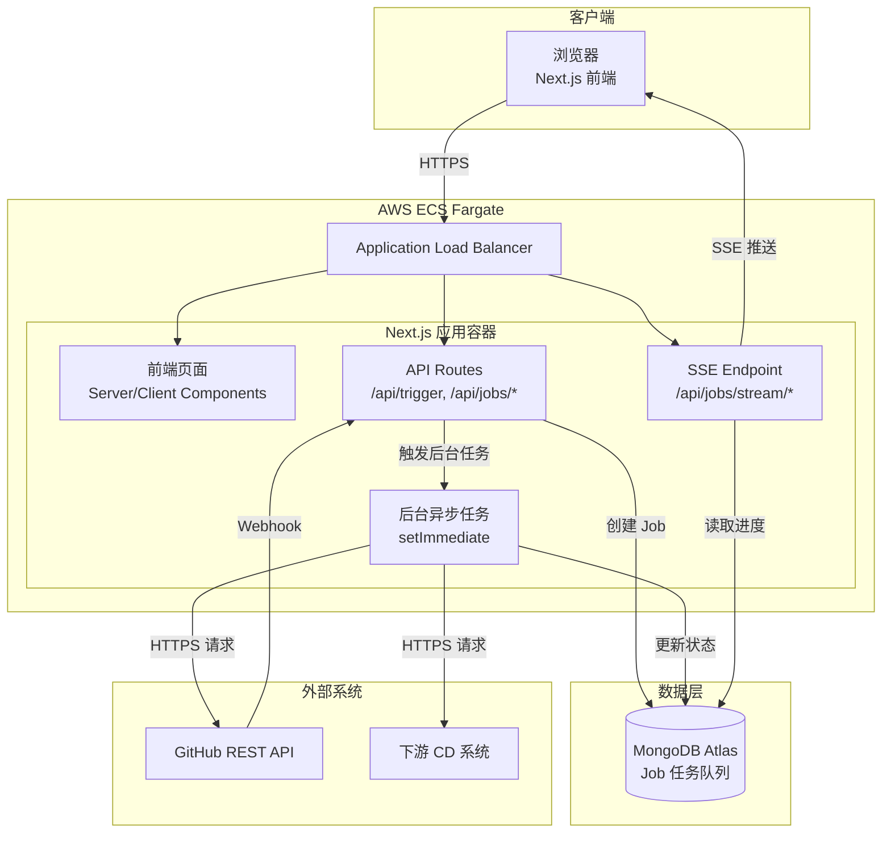
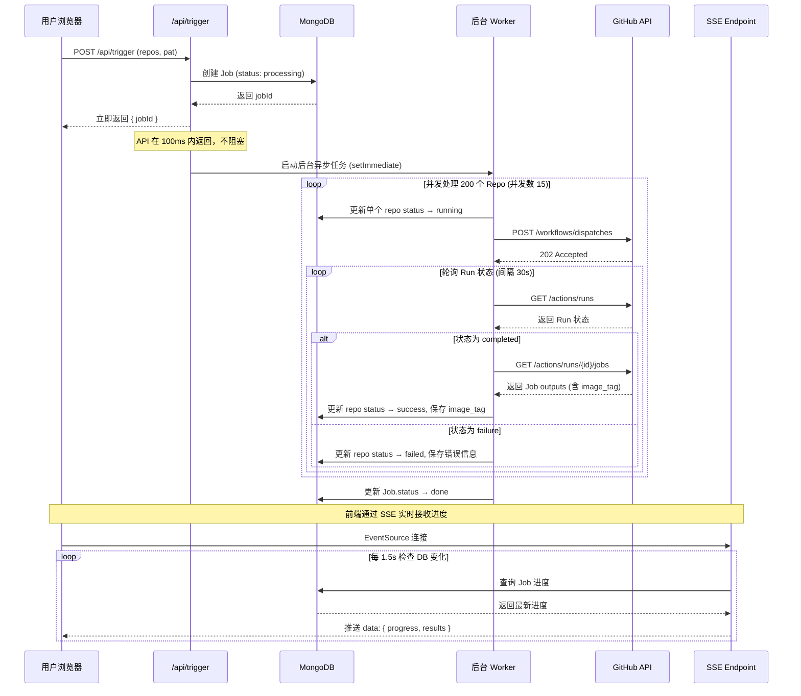
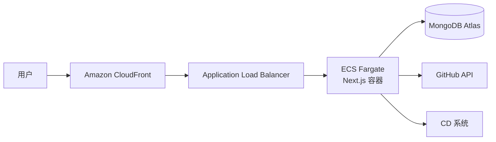

以下是 FleetOps 的两份核心文档——产品规格说明书与技术架构设计文档。

---

# FleetOps 产品规格说明书 (Product Specification)

**版本**: v1.0.0
**日期**: 2026-07-25
**状态**: Draft
**产品经理**: [待定]
**项目代号**: FleetOps

---

## 1. 产品概述

### 1.1 产品定位

FleetOps 是一个面向微服务团队的 **GHA (GitHub Actions) 舰队调度面板**，用于集中管理和操作 200+ 同质化代码仓库的 CI/CD 工作流。产品定位介于“CI/CD 聚合平台”与“内部开发者门户”之间，专注于解决“批量触发 → 制品拾取 → 下游触发”这一垂直场景。

### 1.2 目标用户

| 用户角色 | 特征 | 核心诉求 |
|---------|------|---------|
| **DevOps 工程师** | 管理 200+ 微服务仓库 | 批量触发构建、快速定位失败任务 |
| **研发经理** | 关注交付进度 | 可视化查看所有服务的构建状态 |
| **QA/测试工程师** | 需要特定镜像进行测试 | 快速获取最新构建的 Docker 镜像信息 |
| **产品经理** | 非技术背景 | 通过 GUI 而非命令行完成操作 |

### 1.3 核心价值主张

- **从“命令行脚本”到“可视化面板”**：将散落在各脚本中的 `gh` 命令集中为一个统一 GUI
- **批量操作，效率倍增**：一次点击触发 200 个仓库的 workflow，而非逐个操作
- **端到端闭环**：触发 GHA → 抓取镜像信息 → 触发 CD，一站式完成
- **降低使用门槛**：让非技术团队成员也能安全地触发和管理 CI/CD 流程

### 1.4 使用场景

1. **日常发版**：产品经理在面板上选择目标仓库群，一键触发构建，实时查看进度
2. **故障排查**：DevOps 工程师快速定位构建失败的仓库，查看错误信息
3. **镜像溯源**：QA 团队获取最新构建的 Docker Image Tag，用于测试环境部署
4. **CD 触发**：构建完成后自动或手动触发下游 CD 系统（如 ArgoCD、自研平台）

---

## 2. 术语定义

| 术语 | 定义 |
|------|------|
| **GHA** | GitHub Actions，GitHub 的 CI/CD 平台 |
| **Repo** | 代码仓库 (Repository) |
| **Workflow** | GitHub Actions 中定义的自动化流程（YAML 文件） |
| **Workflow Dispatch** | 通过 API 手动触发 workflow 运行的机制 |
| **Run** | Workflow 的一次执行实例 |
| **Job** | Workflow 中的一个任务单元 |
| **Image Tag** | Docker 镜像的标签，如 `v1.2.3` 或 `sha-abc123` |
| **PAT** | Personal Access Token，GitHub 个人访问令牌 |
| **SSE** | Server-Sent Events，服务器推送技术 |
| **CD** | Continuous Deployment，持续部署 |

---

## 3. 功能需求

### 3.1 用户认证与授权

| 编号 | 功能 | 优先级 | 描述 |
|------|------|--------|------|
| F-01 | PAT 登录 | P0 | 用户输入 GitHub Personal Access Token 完成身份验证 |
| F-02 | PAT 安全存储 | P0 | PAT 仅存储在浏览器内存中，关闭页面即清除，不落盘 |
| F-03 | Token 权限校验 | P1 | 登录时校验 PAT 是否具备所需权限（Actions 读写） |
| F-04 | 多账号支持 | P2 | 支持切换不同 GitHub 账号的 PAT |

### 3.2 仓库管理

| 编号 | 功能 | 优先级 | 描述 |
|------|------|--------|------|
| F-05 | 仓库列表展示 | P0 | 以表格/卡片形式展示所有管理的仓库 |
| F-06 | 仓库分组/筛选 | P1 | 按标签、团队、环境等维度筛选仓库 |
| F-07 | 仓库搜索 | P1 | 按名称快速搜索仓库 |
| F-08 | 批量选择 | P0 | 支持全选/多选仓库进行批量操作 |
| F-09 | 仓库状态概览 | P1 | 显示每个仓库最近的 workflow 运行状态 |

### 3.3 Workflow 触发与监控

| 编号 | 功能 | 优先级 | 描述 |
|------|------|--------|------|
| F-10 | 批量触发 Workflow | P0 | 选中多个仓库，一键触发指定的 workflow |
| F-11 | 触发参数配置 | P1 | 支持在触发时传入自定义 inputs 参数 |
| F-12 | 实时进度展示 | P0 | 通过 SSE 实时推送每个仓库的执行进度 |
| F-13 | 执行结果明细 | P0 | 展示每个仓库的触发状态（成功/失败/运行中） |
| F-14 | 执行历史记录 | P1 | 查看历史触发记录及结果 |
| F-15 | 失败重试 | P1 | 对失败的仓库支持一键重试 |

### 3.4 制品信息拾取

| 编号 | 功能 | 优先级 | 描述 |
|------|------|--------|------|
| F-16 | 自动抓取 Image Tag | P0 | 从 workflow 执行结果中自动提取 Docker 镜像标签 |
| F-17 | Job 输出解析 | P0 | 解析 workflow Job 的 outputs，获取构建产物信息 |
| F-18 | 制品信息展示 | P0 | 在面板中展示每个仓库的最新镜像信息 |
| F-19 | 手动刷新 | P1 | 支持手动刷新单个仓库的制品信息 |

### 3.5 CD 触发

| 编号 | 功能 | 优先级 | 描述 |
|------|------|--------|------|
| F-20 | 手动触发 CD | P0 | 在 UI 上点击按钮，将镜像信息发送到下游 CD 系统 |
| F-21 | 自动触发 CD | P1 | 配置自动规则，构建成功后自动触发 CD |
| F-22 | CD 触发结果反馈 | P1 | 展示 CD 触发是否成功及返回信息 |
| F-23 | CD 系统对接配置 | P1 | 支持配置多个 CD 系统的 API 端点 |

### 3.6 Webhook 接收（进阶）

| 编号 | 功能 | 优先级 | 描述 |
|------|------|--------|------|
| F-24 | GitHub Webhook 接收 | P1 | 接收 GitHub 的 `workflow_run` 事件，实现零轮询 |
| F-25 | Webhook 签名校验 | P1 | 验证 Webhook 请求的签名，确保安全性 |
| F-26 | Webhook 事件处理 | P1 | 将 Webhook 事件转化为任务状态更新 |

---

## 4. 非功能需求

### 4.1 性能

| 需求 | 指标 |
|------|------|
| 并发仓库数 | 支持同时处理 200+ 仓库 |
| 并发控制 | 后端并发数控制在 10-15，防止 GitHub API 限流 |
| 页面加载时间 | < 2 秒（首屏） |
| 进度推送延迟 | < 2 秒（SSE 推送） |
| GitHub API 调用 | < 5,000 次/小时（PAT 限额内） |

### 4.2 可用性

| 需求 | 指标 |
|------|------|
| 系统可用性 | 99.5%（部署后） |
| 任务失败处理 | 自动记录错误信息，支持重试 |
| 断线重连 | SSE 自动重连机制 |

### 4.3 安全性

| 需求 | 描述 |
|------|------|
| PAT 传输 | 仅通过 HTTPS 传输，不落盘 |
| PAT 存储 | 仅存于浏览器内存/会话存储 |
| Webhook 签名 | 生产环境必须验证 GitHub Webhook 签名 |
| CORS 配置 | 生产环境限制允许的 Origin |

### 4.4 可扩展性

| 需求 | 描述 |
|------|------|
| 水平扩展 | 支持部署到多实例 ECS（需 Redis 辅助） |
| 插件化 | 未来支持自定义 CD 对接插件 |
| 数据清理 | 任务记录 1 小时后自动过期清理 |

---

## 5. 用户界面要求

### 5.1 核心页面

| 页面 | 描述 |
|------|------|
| **仪表盘** | 总览所有仓库状态、近期任务统计 |
| **仓库列表** | 展示所有仓库及其状态、最近镜像信息 |
| **批量触发** | 选择仓库、配置参数、触发 workflow |
| **任务详情** | 查看单次批量任务的详细执行结果 |
| **设置** | CD 系统配置、Webhook 配置 |

### 5.2 设计原则

- **清晰的信息层级**：仓库列表 → 批量操作 → 实时反馈
- **进度可视化**：进度条、状态标签、颜色编码（绿/黄/红）
- **响应式设计**：支持桌面端和移动端访问
- **暗色模式**：支持亮色/暗色主题切换

---

## 6. 版本规划

| 版本 | 范围 | 预计时间 |
|------|------|---------|
| **v1.0 MVP** | PAT 登录、仓库列表、批量触发 workflow、SSE 实时进度、镜像信息抓取、手动 CD 触发 | 4-6 周 |
| **v1.1** | 仓库分组/筛选、触发参数配置、执行历史、Webhook 接收 | 2-3 周 |
| **v1.2** | 自动 CD 触发、多账号支持、失败重试 | 2-3 周 |
| **v2.0** | 插件系统、更多 CI/CD 平台集成 | 待定 |

---

# FleetOps 技术架构设计文档 (Technical Architecture Design)

**版本**: v1.0.0
**日期**: 2026-07-25
**状态**: Draft
**技术负责人**: [待定]

---

## 1. 执行摘要

FleetOps 是一个基于 **Next.js (App Router)** 的全栈应用，采用 **异步任务队列 + SSE 实时推送** 的架构模式，用于集中管理 200+ 代码仓库的 GitHub Actions 工作流。

核心架构决策：
- **Next.js 全栈**：统一前后端技术栈，API Routes 处理后端逻辑
- **异步任务模式**：API 触发后立即返回，后台并发处理，避免超时
- **SSE 实时推送**：替代轮询，降低客户端开销，提升用户体验
- **MongoDB 任务队列**：轻量级任务状态持久化，支持进度追踪
- **单实例优先，平滑扩展**：初期单实例 ECS Fargate，未来可加 Redis 实现多实例

---

## 2. 系统概述

### 2.1 系统目的

解决 DevOps 团队在管理大量同质化仓库时面临的“批量触发低效、进度不可视、制品信息分散”的问题。

### 2.2 范围

**范围内**：
- GitHub Actions workflow 批量触发与状态监控
- Workflow 执行产物的信息拾取（Docker Image Tag）
- 下游 CD 系统的触发对接
- 用户通过 PAT 进行 GitHub 认证

**范围外**：
- 仓库的创建/删除/迁移（由 GitHub 管理）
- Workflow 文件的编辑（由代码仓库管理）
- 替代 GitHub Actions 或 CD 系统

### 2.3 假设与约束

| 假设 | 约束 |
|------|------|
| 所有仓库使用同质化的 workflow 文件名 | GitHub REST API 限额 5,000 次/小时 |
| 用户拥有 GitHub 账号及有效 PAT | Next.js API Route 默认 30 秒超时 |
| 下游 CD 系统提供 HTTP API | 初期单实例部署，会话不共享 |

---

## 3. 技术栈

### 3.1 前端

| 类别 | 技术 | 版本 | 用途 |
|------|------|------|------|
| 框架 | Next.js (App Router) | 15.x | 全栈应用框架 |
| 语言 | TypeScript | 5.x | 类型安全 |
| UI 组件 | shadcn/ui | Latest | 组件库（高定制性） |
| 样式 | Tailwind CSS | 3.x | 原子化 CSS |
| 状态管理 | Zustand | 4.x | 客户端状态管理 |
| HTTP 客户端 | Axios / Fetch API | - | API 调用 |
| SSE 客户端 | EventSource API | - | 接收服务器推送 |

### 3.2 后端

| 类别 | 技术 | 版本 | 用途 |
|------|------|------|------|
| 运行时 | Node.js | 20.x | 后端运行环境 |
| 框架 | Next.js API Routes | 15.x | 后端接口 |
| 数据库 | MongoDB | 6.x | 任务状态持久化 |
| ODM | Mongoose | 8.x | MongoDB 对象建模 |
| 并发控制 | p-limit | Latest | 控制并发请求数 |
| 认证 | 自建 PAT 认证 | - | GitHub PAT 验证 |

### 3.3 基础设施

| 类别 | 技术 | 用途 |
|------|------|------|
| 容器化 | Docker | 应用容器化 |
| 容器编排 | AWS ECS Fargate | 无服务器容器部署 |
| 负载均衡 | AWS ALB | 流量分发 |
| 数据库 | MongoDB Atlas | 托管 MongoDB |
| 密钥管理 | AWS Secrets Manager | 环境变量/密钥存储 |
| CI/CD | GitHub Actions | 自动化部署 |
| 日志 | AWS CloudWatch | 日志收集与监控 |

---

## 4. 架构设计

### 4.1 整体架构图



### 4.2 核心流程：批量触发 Workflow



### 4.3 组件说明

#### 组件 1：前端应用 (Next.js App Router)

| 属性 | 描述 |
|------|------|
| **职责** | 渲染 UI、管理客户端状态、建立 SSE 连接、调用 API |
| **技术** | React Server/Client Components, Zustand, Tailwind CSS |
| **关键目录** | `app/` (路由), `components/` (UI 组件), `lib/` (工具函数) |
| **依赖** | 后端 API、SSE Endpoint |

#### 组件 2：API Routes (`/api/*`)

| 属性 | 描述 |
|------|------|
| **职责** | 接收前端请求、创建 Job、触发后台任务、返回任务状态 |
| **技术** | Next.js Route Handlers (App Router) |
| **关键端点** | `POST /api/trigger`, `GET /api/jobs/:jobId` |
| **依赖** | MongoDB、后台 Worker |

#### 组件 3：SSE Endpoint (`/api/jobs/stream/:jobId`)

| 属性 | 描述 |
|------|------|
| **职责** | 建立 SSE 长连接，实时推送任务进度 |
| **技术** | ReadableStream, text/event-stream |
| **推送频率** | 每 1.5 秒检查 DB 变化 |
| **依赖** | MongoDB |

#### 组件 4：后台异步 Worker

| 属性 | 描述 |
|------|------|
| **职责** | 并发处理 200 个仓库的 workflow 触发与状态轮询 |
| **技术** | setImmediate, p-limit (并发控制) |
| **并发数** | 10-15（防止 GitHub 限流） |
| **依赖** | GitHub API、MongoDB、CD 系统 API |

---

## 5. 数据模型

### 5.1 MongoDB Schema

```typescript
// Job 集合 - 代表一次批量触发任务
interface Job {
  jobId: string;           // 唯一标识 (UUID)
  total: number;           // 总仓库数
  completed: number;       // 已完成数 (原子递增)
  status: 'pending' | 'processing' | 'done' | 'failed';
  results: RepoResult[];   // 每个仓库的结果
  createdAt: Date;         // 创建时间 (TTL 索引, 1小时后自动删除)
  updatedAt: Date;         // 更新时间
}

// RepoResult 子文档
interface RepoResult {
  repoName: string;        // 仓库名称
  status: 'pending' | 'running' | 'success' | 'failed';
  imageTag?: string;       // 抓取到的 Docker 镜像标签
  cdTriggered?: boolean;   // CD 是否已触发
  errorMsg?: string;       // 错误信息
  duration?: number;       // 执行耗时 (ms)
  runId?: number;          // GitHub Run ID
}
```

### 5.2 索引策略

| 索引 | 类型 | 用途 |
|------|------|------|
| `{ jobId: 1 }` | 唯一 | 快速查询 Job |
| `{ createdAt: 1 }` | TTL (expireAfterSeconds: 3600) | 自动清理 1 小时前的任务 |
| `{ status: 1, createdAt: -1 }` | 复合 | 查询进行中的任务 |

---

## 6. API 设计

### 6.1 内部 API (前端 → 后端)

| 端点 | 方法 | 请求体 | 响应 | 描述 |
|------|------|--------|------|------|
| `/api/trigger` | POST | `{ repos: string[], pat: string, workflowFile: string, inputs?: object }` | `{ jobId: string }` | 触发批量任务 |
| `/api/jobs/:jobId` | GET | - | `{ status, total, completed, results }` | 查询任务状态 (备用) |
| `/api/jobs/stream/:jobId` | GET (SSE) | - | `text/event-stream` | SSE 实时推送 |
| `/api/webhook/github` | POST | GitHub Webhook Payload | `{ received: true }` | 接收 GitHub Webhook |

### 6.2 外部 API (后端 → GitHub)

| 端点 | 方法 | 用途 |
|------|------|------|
| `POST /repos/:owner/:repo/actions/workflows/:file/dispatches` | POST | 触发 workflow |
| `GET /repos/:owner/:repo/actions/runs?status=in_progress&per_page=1` | GET | 查询最新 Run |
| `GET /repos/:owner/:repo/actions/runs/:run_id/jobs` | GET | 获取 Job 输出 |

---

## 7. 安全设计

### 7.1 认证与授权

- **PAT 认证**：用户通过 GitHub PAT 进行身份验证，PAT 仅在请求体中传输
- **PAT 存储**：前端存于 `sessionStorage`，关闭页面即清除；后端不持久化
- **权限校验**：登录时调用 `GET /user` 验证 PAT 有效性，并检查 Actions 权限

### 7.2 数据安全

- **传输加密**：全站 HTTPS（AWS ALB + TLS）
- **敏感数据**：PAT 不落盘、不记日志
- **Webhook 安全**：生产环境验证 GitHub Webhook 签名

### 7.3 环境隔离

- 开发/测试/生产环境使用独立的 MongoDB 实例和密钥

---

## 8. 部署架构 (AWS ECS)

### 8.1 基础设施



### 8.2 容器配置

| 配置项 | 值 |
|------|------|
| 基础镜像 | `node:20-alpine` |
| 构建命令 | `npm run build` |
| 启动命令 | `npm start` (即 `next start`) |
| CPU | 1 vCPU |
| 内存 | 2 GB |
| 端口 | 3000 |
| 环境变量 | `MONGODB_URI`, `GITHUB_WEBHOOK_SECRET` |

### 8.3 扩展策略

| 阶段 | 实例数 | 说明 |
|------|--------|------|
| MVP | 1 | 单实例，后台任务在内存中运行 |
| 生产 (初期) | 1-2 | 如需多实例，需引入 Redis Pub/Sub 同步 SSE 状态 |
| 未来 | 2+ | 配合 Redis 实现水平扩展 |

### 8.4 CI/CD 流水线

```yaml
# .github/workflows/deploy.yml (示意)
name: Deploy to ECS
on:
  push:
    branches: [main]
jobs:
  deploy:
    steps:
      - 代码检出
      - 构建 Docker 镜像
      - 推送到 Amazon ECR
      - 更新 ECS 服务 (蓝绿部署)
```

---

## 9. 性能与扩展性考量

### 9.1 GitHub API 限额管理

| 策略 | 描述 |
|------|------|
| 轮询间隔 | 30 秒/次，而非 5 秒 |
| 状态过滤 | 仅查询 `status=in_progress` 的 Run |
| 动态退出 | Run 完成后立即停止轮询，不等待超时 |
| 并发控制 | 同时最多 15 个并发请求 |

### 9.2 数据库优化

| 策略 | 描述 |
|------|------|
| TTL 索引 | 1 小时后自动清理历史任务 |
| 原子更新 | 使用 `$inc` 原子递增 `completed` 计数 |
| 投影查询 | SSE 仅查询必要字段，减少传输量 |

### 9.3 前端优化

| 策略 | 描述 |
|------|------|
| SSE 替代轮询 | 单连接接收所有更新 |
| 虚拟滚动 | 仓库列表超过 100 项时使用虚拟滚动 |
| 懒加载 | 非首屏组件按需加载 |

---

## 10. 监控与日志

| 组件 | 工具 | 监控指标 |
|------|------|---------|
| 应用日志 | AWS CloudWatch | API 请求日志、错误日志 |
| 性能监控 | AWS CloudWatch | CPU、内存、响应时间 |
| GitHub API 调用 | 自定义指标 | 调用次数、限额使用率 |
| 任务成功率 | 自定义指标 | 批量任务成功率、平均耗时 |

---

## 11. 风险与缓解

| 风险 | 影响 | 缓解措施 |
|------|------|---------|
| GitHub API 限流 | 任务中断 | 轮询间隔 30s、并发控制 15、状态过滤 |
| Next.js API 超时 (30s) | 请求失败 | 异步任务模式，API 立即返回 |
| 单实例故障 | 服务不可用 | ECS 自动重启 + 健康检查 |
| PAT 泄露 | 安全事件 | 仅存内存、不落盘、不记日志 |
| SSE 连接断开 | 前端进度中断 | EventSource 自动重连机制 |
| 多实例部署时 SSE 状态不同步 | 推送错乱 | 初期单实例；多实例时引入 Redis Pub/Sub |

---

## 12. 未来演进路径

| 阶段 | 演进内容 |
|------|---------|
| **短期 (v1.1)** | Webhook 接收替代轮询、仓库分组筛选 |
| **中期 (v1.2)** | Redis 支持多实例部署、自动 CD 触发 |
| **长期 (v2.0)** | 多 CI/CD 平台支持 (GitLab CI, Jenkins)、插件系统 |
